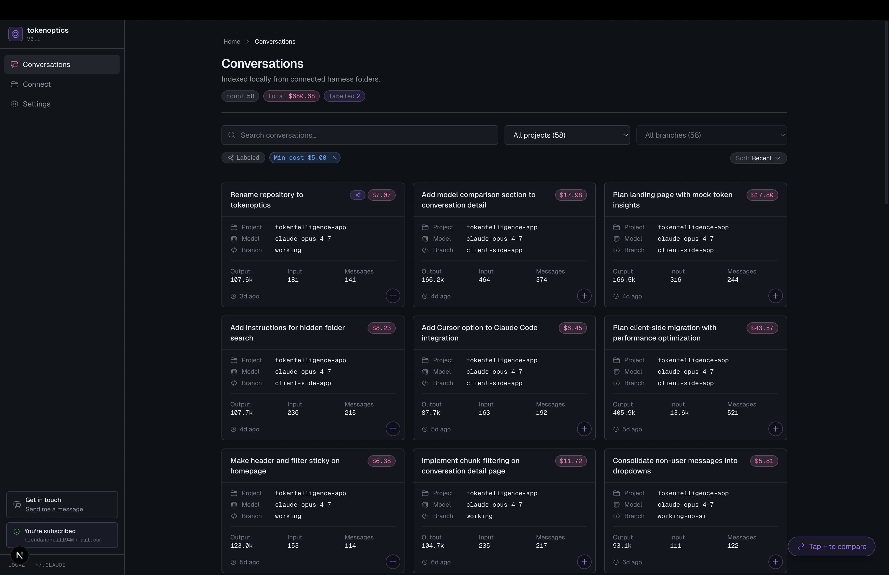
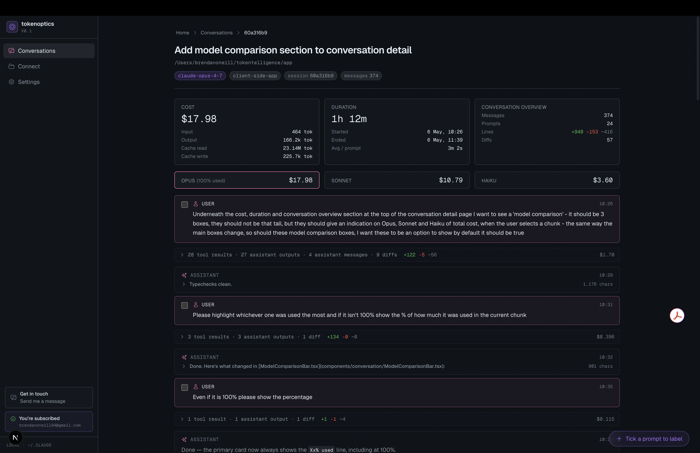

# Tokenoptics

**Token-level visibility into your Claude Code spend — built on the transcripts already on your machine.**

Tokenoptics reads the session logs Claude Code writes to `~/.claude` and turns them into a navigable view of every conversation, branch, chunk, and model. See where the tokens went, what each session would have cost on the metered API, and which habits are quietly expensive — before usage-based pricing becomes the default.

[**Try it →** tokenoptics.dev](https://tokenoptics.dev)



## Why

Most developers using AI today are on flat-rate plans — the per-token cost is invisible by design. The leading labs are absorbing real costs to capture market share, and that subsidy won't last forever. The habits you form on a plan will get repriced when the meter turns on.

The longer-form argument lives at [/why](https://tokenoptics.dev/why).

## What it shows

- **Per-conversation breakdown** — input, output, cache reads, and cache writes for every session, chunk, and tool call.
- **Branch-aware navigation** — Claude Code conversations fork; Tokenoptics surfaces the tree so you can see which branches you actually used and which you abandoned.
- **Chunk-level cost** — every prompt-to-response unit priced individually, with diffs against the previous chunk so you can see what each turn changed.
- **Model comparison** — replay any conversation's token shape against Opus / Sonnet / Haiku pricing to see what it would have cost on a different tier.
- **Efficiency hints** — flags long error loops, oversized context, and other patterns worth knowing about.



## Privacy

Tokenoptics runs entirely in your browser. There is no backend, no account, no telemetry on your transcript content.

- Your `~/.claude` folder is read locally via the [File System Access API](https://developer.mozilla.org/en-US/docs/Web/API/File_System_API) — the browser asks for read-only permission to that directory and never uploads its contents.
- Parsed conversations are stored in your browser's IndexedDB (via [Dexie](https://dexie.org/)) and never leave the device.
- The hosted app uses [Vercel Analytics](https://vercel.com/docs/analytics) for anonymised page-view metrics. No transcript content, prompt content, or token data is included in analytics.

If you'd rather not trust the hosted version, run it locally — instructions below — or read the source. The relevant entry points are [`components/connect/FolderConnect.tsx`](components/connect/FolderConnect.tsx) and [`lib/storage/browser/`](lib/storage/browser/).

## Browser support

Tokenoptics depends on the File System Access API, which is currently Chromium-only. It works in:

- Chrome, Edge, Arc, Brave, Opera (desktop)

It does **not** work in Firefox or Safari. Mobile browsers are not supported — there's no `~/.claude` folder to point at.

## Run locally

Requires Node 20+ and a Chromium-based browser.

```bash
git clone https://github.com/brenoneill/tokenoptics.git
cd tokenoptics
npm install
npm run dev
```

Open [http://localhost:3000](http://localhost:3000), click **Connect**, and point the picker at your `~/.claude/projects` folder.

### Other scripts

```bash
npm run build   # production build
npm run start   # run the production build
npm run lint    # eslint
```

## Tech stack

- [Next.js 16](https://nextjs.org/) (App Router) + React 19
- TypeScript
- Tailwind CSS v4
- [Dexie](https://dexie.org/) for IndexedDB storage
- File System Access API for local folder reads
- Deployed on [Vercel](https://vercel.com/)

## Project layout

```
app/                     Next.js routes (landing, /why, /conversations, /connect, /settings)
components/
  landing/               Marketing page sections
  conversation/          Conversation view, chunks, diffs, model comparison
  connect/               Folder-mount UI
  ui/                    Shared primitives
lib/
  harnesses/             Adapters per source (Claude Code today; pluggable)
  storage/browser/       File System Access + Dexie + sync worker
  efficiency/            Cost shaping, chunk pricing, rules
  normalize.ts           JSONL → Conversation model
  pricing.ts             Per-model token prices
```

## Contributing

This is published as open source so anyone can read, fork, audit, or run it themselves. I'm not actively running it as a community project right now, but contribution ideas are welcome — please [open an issue](https://github.com/brenoneill/tokenoptics/issues) to discuss before starting work on anything substantial. That posture may change over time.

## License

MIT — see [LICENSE](LICENSE).
